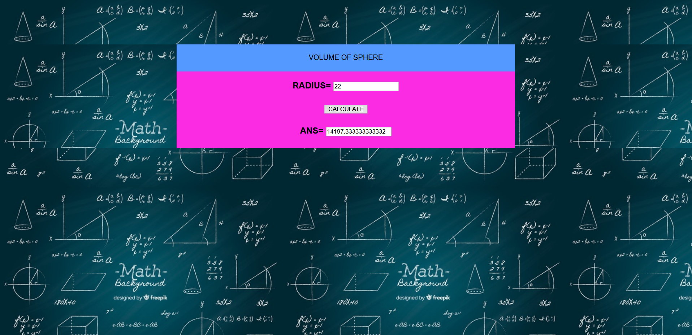
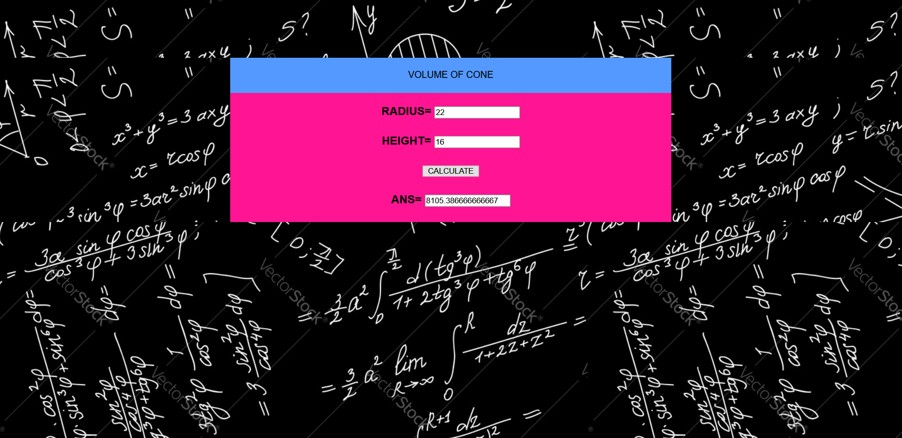
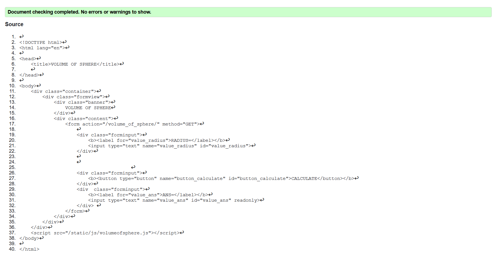
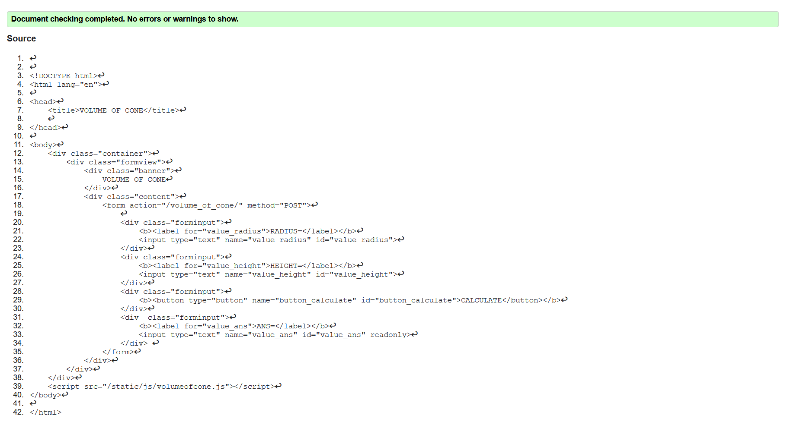

# Mathematical Calculations using JavaScript
## AIM:
To design a website to calculate the area of a circle and volume of a cylinder using JavaScript.

## DESIGN STEPS:
### Step 1: 
Requirement collection.
### Step 2:
Creating the layout using HTML and CSS.
### Step 3:
Write JavaScript to perform calculations.
### Step 4:
Choose the appropriate style and color scheme.
### Step 5:
Validate the layout in various browsers.
### Step 6:
Validate the HTML code.
### Step 6:
Publish the website in the given URL.


## PROGRAM:

### volume_of_sphere.html
```

<!DOCTYPE html>
<html>

<head>
    <title>VOLUME OF SPHERE</title>
    <link rel="stylesheet" href="">
</head>

<body>
    <div class="container">
        <div class="formview">
            <div class="banner">
                VOLUME OF SPHERE
            </div>
            <div class="content">
                <form action="/volume_of_sphere/" method="GET">
                    
                    <div class="forminput">
                        <b><label for="value_radius">RADIUS=</label></b>
                        <input type="text" name="value_radius" id="value_radius">
                    </div>
                    
                    
                                       
                    <div class="forminput">
                        <b><button type="button" name="button_calculate" id="button_calculate">CALCULATE</button></b>
                    </div>
                    <div  class="forminput">
                        <b><label for="value_ans">ANS=</label></b>
                        <input type="text" name="value_ans" id="value_ans" readonly>
                    </div> 
                </form>
            </div>
        </div>
    </div>
    <script src="/static/js/volumeofsphere.js"></script>
</body>

</html>

```
### volume_of_cone.html

```


<!DOCTYPE html>
<html>

<head>
    <title>VOLUME OF CONE</title>
    <link rel="stylesheet" href="">
</head>

<body>
    <div class="container">
        <div class="formview">
            <div class="banner">
                VOLUME OF CONE
            </div>
            <div class="content">
                <form action="/volume_of_cone/" method="POST">
                    
                    <div class="forminput">
                        <b><label for="value_radius">RADIUS=</label></b>
                        <input type="text" name="value_radius" id="value_radius">
                    </div>
                    <div class="forminput">
                        <b><label for="value_height">HEIGHT=</label></b>
                        <input type="text" name="value_height" id="value_height">
                    </div>
                    <div class="forminput">
                        <b><button type="button" name="button_calculate" id="button_calculate">CALCULATE</button></b>
                    </div>
                    <div  class="forminput">
                        <b><label for="value_ans">ANS=</label></b>
                        <input type="text" name="value_ans" id="value_ans" readonly>
                    </div> 
                </form>
            </div>
        </div>
    </div>
    <script src="/static/js/volumeofcone.js"></script>
</body>

</html>


```
### volume_of_sphere.js


```

a = document.querySelector('#button_calculate');

a.addEventListener('click',function(e){
    radius  = document.querySelector('#value_radius');
    answer = document.querySelector('#value_ans');

    let sphere;
    sphere = 4/3 * parseFloat(radius.value) * parseFloat(radius.value) * parseFloat(radius.value);
    answer.value = sphere;
     
})

```

### volume_of_cone.js

```
a = document.querySelector('#button_calculate');

a.addEventListener('click',function(e){
    radius  = document.querySelector('#value_radius');
    height = document.querySelector('#value_height');
    answer = document.querySelector('#value_ans');

    let cone;
    cone = 1/3  * 3.14 * parseFloat(radius.value) * parseFloat(radius.value) * parseFloat(height.value);
    answer.value = cone;
     
})

```

## OUTPUT : 





## VALIDATION REPORT:






## RESULT : 

   Thus a website is designed for the calculation of volume of sphere using Javascript and is hosted in the URL http://priyadarshini.student.saveetha.in:8000/volume_of_sphere/. HTML code is validated. 

   Thus a website is designed for the calculation of volume of cone using Javascript and is hosted in the URL http://priyadarshini.student.saveetha.in:8000/volume_of_cone/ .HTML code is validated. 

